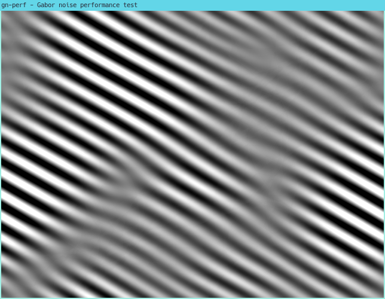

# gn-perf

This tool implements various optimizations to procedural noise based on sparse Gabor
convolution in order to evaluate their performance.



## Dependencies

* Boost
* GLFW3
* epoxy
* libshadertoy (included in `libshadertoy/`)
* PicoSHA2 (included in `PicoSHA2/`)
* libpng++

```bash
sudo apt install build-essential git cmake pkg-config libepoxy-dev libboost-filesystem-dev \
                 libboost-date-time-dev libboost-program-options-dev libgl1-mesa-dev libglm-dev \
                 libunwind-dev libpng++-dev libsoil-dev libopenexr-dev \
                 libxrandr-dev libxinerama-dev libxcursor-dev libxi-dev
```

## Getting started

```bash
git clone --recursive https://gitlab.inria.fr/vtaverni/gn-perf.git
cd gn-perf
mkdir build && cd build
cmake ..
make -j$(nproc)
./gn_perf -DTILE_SIZE=16 -DF0=16 -DSPLATS=16 -s 512
```

## Usage

The parameters of the Gabor noise shader are controlled through a set of preprocessor
definitions. These are set up using the `-D` argument. Configuration file options are
overridden by those on the command line. See `./gn_perf -h` for the full configuration.

## Author

Vincent Tavernier <vince.tavernier@gmail.com>

## License

The source code in this repository is licensed under the [MIT license](LICENSE).
